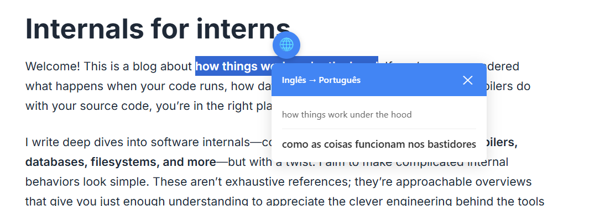

# 🌐 Tradutor de Seleção - Extensão Chrome

Extensão para traduzir textos selecionados instantaneamente no navegador.

Veja exemplo:



## 📋 Arquivos Necessários

Crie uma pasta com os seguintes arquivos:

1. `manifest.json` - Configuração da extensão
2. `popup.html` - Interface de configurações
3. `popup.js` - Lógica do popup
4. `content.js` - Script principal
5. `content.css` - Estilos
6. `background.js` - Service worker
7. Ícones: `icon16.png`, `icon48.png`, `icon128.png`

## 🎨 Criar os Ícones

Você precisa criar 3 ícones com as seguintes dimensões:

- `icon16.png` (16x16 pixels)
- `icon48.png` (48x48 pixels)
- `icon128.png` (128x128 pixels)

**Dica:** Use um ícone simples de globo 🌐 ou crie no [Canva](https://www.canva.com) ou [Photopea](https://www.photopea.com).

## 📦 Como Instalar no Chrome

1. **Organize os arquivos:**

   ```
   tradutor-extensao/
   ├── manifest.json
   ├── popup.html
   ├── popup.js
   ├── content.js
   ├── content.css
   ├── background.js
   ├── icon16.png
   ├── icon48.png
   └── icon128.png
   ```

2. **Abra o Chrome** e digite na barra de endereços:

   ```
   chrome://extensions/
   ```

3. **Ative o "Modo do desenvolvedor"** (canto superior direito)

4. **Clique em "Carregar sem compactação"**

5. **Selecione a pasta** `tradutor-extensao`

6. **Pronto!** A extensão está instalada ✅

## 🚀 Como Usar

1. **Configure o idioma:**

   - Clique no ícone da extensão na barra do Chrome
   - Selecione o idioma desejado (padrão: Português)
   - Clique em "Salvar Configurações"

2. **Traduza textos:**
   - Selecione qualquer texto em uma página
   - Clique no botão 🌐 que aparece
   - Veja a tradução instantânea!

## ✨ Funcionalidades

- ✅ Detecção automática do idioma de origem
- ✅ Tradução para 11 idiomas diferentes
- ✅ Interface limpa e intuitiva
- ✅ Funciona em qualquer site
- ✅ 100% JavaScript puro (sem dependências)
- ✅ Usa a API gratuita do Google Translate

## 🌍 Idiomas Suportados

- Português 🇧🇷
- Inglês 🇺🇸
- Espanhol 🇪🇸
- Francês 🇫🇷
- Alemão 🇩🇪
- Italiano 🇮🇹
- Japonês 🇯🇵
- Coreano 🇰🇷
- Chinês Simplificado 🇨🇳
- Russo 🇷🇺
- Árabe 🇸🇦

## 🔧 Solução de Problemas

**A extensão não aparece:**

- Verifique se todos os arquivos estão na pasta
- Certifique-se de que os ícones existem
- Recarregue a extensão em `chrome://extensions/`

**Tradução não funciona:**

- Verifique sua conexão com a internet
- Alguns sites bloqueiam extensões (ex: Chrome Web Store)

**Botão não aparece:**

- Recarregue a página (F5)
- Verifique se selecionou texto suficiente (mínimo 1 caractere)

**Desenvolvido com ❤️ usando JavaScript puro**
